# AI-Assisted Content Moderation Platform

A production-grade full-stack web application for moderating user-submitted articles and comments with AI-powered toxicity and sentiment analysis.

## Live URL

[https://repoweb-production-4b94.up.railway.app](https://repoweb-production-4b94.up.railway.app)

## Services


The platform runs as three isolated containers on Railway, each with a single responsibility and a hard boundary between them.

**Postgres** is the source of truth. PostgreSQL 16 backed by a persistent volume so data survives deploys and restarts. The schema is managed entirely through Prisma migrations — the API container runs `prisma migrate deploy` on every startup, which means schema and application code are always in lockstep with zero manual intervention. Five tables: `users`, `submissions`, `ai_analyses`, `moderation_logs`, and `audit_logs`. No direct external access — only the API talks to it.

**@repo/api** owns all business logic and is the only service that touches the database. Express.js on port 4000 with a strict layered architecture: routes → controllers → services → repositories → Prisma. Authentication is JWT-based with access tokens (15 min) and refresh tokens (7 days), both stored in `httpOnly` cookies — inaccessible to JavaScript, eliminating the XSS attack surface entirely. Status transitions are wrapped in `prisma.$transaction` so a submission update and its audit log entry are atomic — either both commit or neither does. The AI analysis layer calls OpenAI, caches the result immediately, and has a graceful fallback that stores `errorFlag: true` rather than surfacing a 500 to the user. Every significant action — login, failed auth, 403, submission create, status change, AI trigger, admin seed — is written to the `audit_logs` table with IP address, user-agent, and timestamp.

**@repo/web** is a pure presentation layer — it owns no state and holds no secrets. Next.js 14 App Router with server components for data fetching and client components only where interactivity is required. The JWT lives in an `httpOnly` cookie the browser cannot read, so client-side code cannot attach it to outbound requests. The solution: all mutation requests go through Next.js server-side route handlers (`/api/proxy/*`) which read the cookie server-side and forward it as a `Bearer` token to the API. The browser never sees the token. Data flows one way — server components fetch on the server, render HTML, ship it to the client.


---

## Engineering Architecture & Development Standards

### 1. System Architecture Overview

The platform is a **3-tier Turborepo monorepo** with strict package boundaries and unidirectional data flow.

```
packages/database   →   apps/api   →   apps/web
(Prisma schema)         (Express)       (Next.js 14)
```

**Turborepo pipeline** (`turbo.json`):
- `build` depends on `^build` — database package always compiles before API
- `test` depends on `^build` — ensures Prisma client is generated before tests run
- `dev` is persistent with no caching — runs all services in parallel

**Runtime request path:**

```
Browser
  → Next.js (server components fetch data server-side)
  → Express API (JWT verify → role check → controller → service → repository → Prisma)
  → PostgreSQL
```

**Key architectural constraint:** JWT tokens live in `httpOnly` cookies — JavaScript cannot read them. This forces all token-bearing requests from client components through Next.js server-side route handlers (`/api/proxy/*`) which read the cookie and forward it as a `Bearer` token. The browser never touches the token directly.

**Cross-cutting concerns (all independent of core business logic):**

| Concern | Tool | Pattern |
|---|---|---|
| Error monitoring | Sentry | Singleton init via `initSentry()` in `instrument.ts` |
| LLM observability | Langfuse | Lazy singleton via `getLangfuse()` |
| Compliance audit trail | `audit_logs` table | Fire-and-forget via `getAuditService()` singleton |

---

### 2. Design Principles

Every design principle is demonstrated by concrete code in this codebase — not aspirational.

| Principle | Where it appears |
|---|---|
| **Single Responsibility (S)** | `AuditService` only writes audit logs. `ResponseFactory` only shapes response envelopes. `jwt.util.ts` only signs and verifies tokens. Each class has exactly one reason to change. |
| **Open / Closed (O)** | `IAnalysisProvider` interface. Adding Claude or Gemini requires creating one new class — `AnalysisService`, `AnalysisController`, and every test are untouched. |
| **Liskov Substitution (L)** | `OpenAIProvider` is fully substitutable for any `IAnalysisProvider`. The service never checks which concrete provider it received. |
| **Interface Segregation (I)** | `IAuditLogRepository` exposes only `create`. `ISubmissionRepository` exposes only what submissions need. No fat interfaces that force unused method implementations. |
| **Dependency Inversion (D)** | `AnalysisService(provider: IAnalysisProvider, repo: IAnalysisRepository, subRepo: ISubmissionRepository)` — the service depends entirely on abstractions. Concrete classes are wired in route files at the edge. |
| **DRY** | `ResponseFactory.success / error / created / paginated` — one response envelope used across all 9 endpoints. No inline `res.json({ success: true, ... })` anywhere. |
| **Separation of Concerns** | Routes (wiring) → Controllers (parse + respond) → Services (business logic) → Repositories (DB) → Prisma. No layer skips. Controllers never touch Prisma. Services never touch `req`/`res`. |
| **Fail Fast** | `src/config/env.ts` uses Zod to validate all environment variables at process startup. If `JWT_SECRET` is missing or too short, the process exits before accepting any connections. |
| **Graceful Degradation** | `getLangfuse()` returns `null` if `LANGFUSE_PUBLIC_KEY` is absent. `initSentry()` no-ops if `SENTRY_DSN` is absent. The application runs normally without either observability tool. |

---

### 3. Design Patterns

| Pattern | File(s) | Purpose |
|---|---|---|
| **Repository** | `src/repositories/` + `src/interfaces/repositories/I*.ts` | All Prisma queries sit behind interfaces. Services never import Prisma directly. Enables unit testing with mocks instead of a real database. |
| **Strategy** | `src/interfaces/providers/IAnalysisProvider.ts` + `src/providers/openai.provider.ts` | Swappable AI backend. The strategy (which LLM to call) is injected at construction time, not hardcoded. |
| **Singleton** | `getAuditService()`, `getLangfuse()`, `initSentry()` | One instance per process lifetime. Lazy initialisation (`instance ??= new X()`) prevents multiple DB connections or SDK clients. |
| **Factory** | `src/utils/response.factory.ts` | Static factory class producing typed `{ status, body }` objects. Controllers destructure these and pass them directly to `res.status().json()`. |
| **Adapter** | `src/providers/openai.provider.ts` | Wraps the OpenAI SDK (third-party) behind the `IAnalysisProvider` interface (domain). The rest of the codebase never imports `openai` directly. |
| **Middleware Chain** | `src/app.ts` | Express middleware stack: `helmet` → `cors` → body parsers → routes → 404 → Sentry error handler → global error handler. Each middleware is a single-purpose function. |
| **Proxy** | `apps/web/src/app/api/proxy/*/route.ts` | Next.js Route Handlers act as server-side proxies — they read the `httpOnly` cookie and attach a `Bearer` token before forwarding to the Express API. |
| **DTO (Data Transfer Object)** | `CreateSubmissionDto`, `CreateAuditLogDto`, `LoginDto` etc. | Typed boundary objects at each layer transition. Input is validated by Zod before a DTO is constructed. |
| **Constructor Injection** | All route files | Manual dependency injection without an IoC container: `new AuthController(new AuthService(new UserRepository()))`. Dependencies flow inward; concrete classes are only named at the outermost layer. |
| **Fire-and-Forget** | `src/services/audit.service.ts` — `log()` method | Audit writes are initiated but never awaited. A `.catch()` sends any failure to Sentry. The HTTP response is never delayed by audit I/O. |

---

### 4. Branching Strategy

This project follows a **Git Flow–inspired** branching model with one branch per deliverable.

```
main          ← production-ready; auto-deploys to Railway on push
  └─ develop  ← integration branch; all features merge here first
       ├─ feat/project-setup-and-tooling
       ├─ feat/database-schema-and-migrations
       ├─ feat/auth-module
       ├─ feat/content-submission-api
       ├─ feat/ai-moderation-layer
       ├─ feat/moderation-dashboard
       ├─ feat/testing-suite
       ├─ feat/containerisation-and-deployment
       ├─ feat/langfuse-observability
       ├─ feat/sentry-integration
       └─ fix/bugs
```


**Merge policy:**
1. All feature branches target `develop`
2. CI must pass (typecheck + lint + 25 tests) before merge
3. `develop` → `main` via release PR — triggers Railway auto-deploy

---

### 5. Database Migration Strategy

Schema evolution is managed entirely through **Prisma Migrate** with zero manual SQL.

| Command | When to use |
|---|---|
| `pnpm --filter @repo/database db:migrate` | Local dev — creates a new migration file and applies it |
| `pnpm --filter @repo/database db:deploy` | CI / production — applies pending migrations only, no new files created |
| `pnpm --filter @repo/database db:reset` | Local only — drops all tables, re-applies all migrations, re-seeds |
| `pnpm --filter @repo/database db:seed` | Local / staging — inserts test users and submissions |
| `pnpm --filter @repo/database db:studio` | Local — opens Prisma Studio visual DB browser |

**Migration history:**

| Migration | Contents |
|---|---|
| `20260611173520_init` | 4 tables (`users`, `submissions`, `moderation_logs`, `ai_analyses`), 5 enums, 8 indexes, FK constraints |
| `20260613171742_add_audit_log` | `audit_logs` table, `AuditAction` enum (10 values), 4 indexes |

**Production safety:**
- `prisma migrate deploy` runs automatically inside the API Docker `CMD` on every container startup — schema and code are always in lockstep with no manual step
- Rollback = a new corrective migration (Prisma has no native rollback command)
- `migration_lock.toml` prevents two containers from running migrations simultaneously
- `seed.ts` exits immediately if `NODE_ENV === 'production'` — no default credentials can be created in production

---

### 6. Deployment & Release Strategy

**Platform:** Railway (managed PaaS — no infrastructure to manage)

**Deployment model:** Rolling Deployment

Railway replaces containers one at a time. The old container continues serving traffic until the new one passes its health check, then traffic switches over. This gives zero-downtime deploys without requiring a load balancer configuration.

**Release flow:**

```
feat/* branch
  → PR to develop
  → CI: typecheck + lint + 25 tests (against ephemeral PostgreSQL)
  → Merge to develop
  → PR to main
  → Merge to main
  → Railway auto-deploys API and Web containers
  → API startup: prisma migrate deploy (schema in sync)
  → Health checks: HEALTHCHECK in both Dockerfiles
  → Traffic switches when health check passes
```

**Docker build strategy (multi-stage):**

```dockerfile
Stage 1: builder   — installs all deps, compiles TypeScript, generates Prisma client
Stage 2: runner    — copies only compiled output, no devDependencies, minimal attack surface
```

**Container security:**
- API runs as `nodeuser` (uid 1001, gid 1001) — not root
- Web runs as `nextjs` (uid 1001) — not root
- Both have `HEALTHCHECK` — Railway restarts unhealthy containers automatically

**`NEXT_PUBLIC_*` vars** are baked at build time via Docker `ARG` → `ENV` → `next build`. They cannot be changed at runtime without rebuilding the image.

**Rollback procedure:** Select a previous deployment in the Railway dashboard and redeploy. The previous image is retained. `prisma migrate deploy` on the old image is a no-op if the schema matches.

---

### 7. Scalability & Maintainability

**Extensibility by design:**

| Decision | Benefit |
|---|---|
| `IAnalysisProvider` interface | Swap OpenAI for any LLM (Claude, Gemini, local) by adding one class — zero changes to services or tests |
| Repository pattern | Add a new data store (Redis cache, S3) by implementing an interface — service layer is untouched |
| Monorepo with package boundaries | `packages/database` can be imported by any future `apps/*` without schema duplication |

**Performance decisions:**

| Decision | Benefit |
|---|---|
| `Promise.all([findMany, count])` in `SubmissionRepository.list()` | Parallelises two DB queries — halves latency on the most-hit endpoint |
| `UNIQUE(submissionId)` on `ai_analyses` | Prevents duplicate OpenAI calls at the DB level, not just the service layer |
| 10+ composite indexes on `status`, `type`, `submittedAt`, `moderatorId + createdAt` | All list and filter queries use index scans, not full table scans |
| Next.js server components | HTML rendered on the server — no client-side data fetching waterfall |
| AI result cached on first analysis | Subsequent requests are a single DB read |

**Observability (three independent layers):**

```
Sentry      → application errors, slow requests, session replay (what broke)
Langfuse    → LLM prompt/response/latency/score per analysis call (what the AI did)
audit_logs  → compliance trail of every user action (who did what and when)
```

**Quality gates enforced in CI:**

- TypeScript strict mode — no implicit `any`
- ESLint `no-explicit-any` error, `no-unused-vars` error
- 80% line/function coverage, 75% branch coverage (vitest thresholds)
- All 25 tests must pass against a real PostgreSQL instance

---

### 8. Development Standards

**TypeScript & Code Style**

All packages use TypeScript with strict mode. Code style is enforced by ESLint and Prettier — no manual formatting decisions.

| Tool | Key rules |
|---|---|
| ESLint | `no-explicit-any` (error), `no-unused-vars` (error), `explicit-function-return-type` (warn) |
| Prettier | `singleQuote: true`, `semi: true`, `trailingComma: 'es5'`, `printWidth: 100` |
| TypeScript | Strict mode, `noImplicitAny`, path aliases via `tsconfig.json` |

**Error Handling Strategy**

All application errors extend a single `AppError` base class with a `statusCode` and `code` field. The global error handler in `src/middleware/error-handler.ts` is the single exit point for all errors.

```
AppError (base)
  ├── NotFoundError          → 404  NOT_FOUND
  ├── UnauthorizedError      → 401  UNAUTHORIZED
  ├── ForbiddenError         → 403  FORBIDDEN
  ├── BadRequestError        → 400  BAD_REQUEST
  ├── ConflictError          → 409  CONFLICT
  └── InvalidStatusTransitionError → 400  INVALID_STATUS_TRANSITION
```

Sentry filtering: `4xx AppErrors` are captured as breadcrumbs only (expected client errors, not bugs). `5xx` and unexpected errors are fully captured with stack trace and user context.

**Security Standards**

| Practice | Implementation |
|---|---|
| Token storage | JWT in `httpOnly`, `secure`, `sameSite=strict` cookies — inaccessible to JavaScript |
| Password hashing | bcrypt with 12 salt rounds (constant-time comparison via `bcrypt.compare`) |
| Input validation | Zod schemas on all request bodies and query params via `validate` middleware |
| Rate limiting | Login: 10 requests / 15 min per IP. AI analysis: 20 requests / hour per user |
| Security headers | `X-Frame-Options: DENY`, `HSTS`, `X-Content-Type-Options: nosniff`, `Referrer-Policy`, `Permissions-Policy` |
| PII scrubbing | Sentry `beforeSend` strips `request.cookies` and `Authorization` headers before any event is shipped |
| Production seed guard | `seed.ts` exits immediately if `NODE_ENV === 'production'` |
| Container hardening | Non-root users (`nodeuser`, `nextjs`) in both Docker images |

**Testing Approach**

| Layer | Framework | What is tested |
|---|---|---|
| Unit — Services | Vitest + mocked repositories | Business logic, status transitions, AI fallback, bcrypt comparison |
| Unit — Repositories | Vitest + mocked Prisma | Query construction, filter logic, pagination |
| Integration — Routes | Vitest + Supertest + real Prisma | Full HTTP request lifecycle against mocked DB layer |
| CI environment | GitHub Actions + ephemeral PostgreSQL | All 25 tests run against a real database on every PR |

Coverage thresholds enforced: **80% lines/functions/statements, 75% branches**.

---

## Tech Stack

| Layer | Technology |
|-------|-----------|
| Frontend | Next.js 14 (App Router), TypeScript, TailwindCSS |
| Backend | Node.js, Express.js, TypeScript |
| Database | PostgreSQL 16, Prisma ORM |
| AI | OpenAI GPT-4o-mini (Chat Completions) |
| Observability | Langfuse (LLM tracing), Sentry (error monitoring, performance, session replay) |
| Infrastructure | Docker, Docker Compose, Railway |
| Testing | Vitest, Supertest |

---

## Local Setup

### Prerequisites
- Node.js 20+
- pnpm 9+ (`npm install -g pnpm`)
- Docker & Docker Compose

### Option A — Docker Compose (recommended, runs everything)

```bash
# 1. Clone the repository
git clone https://github.com/Aryan4717/fullstack-l2-assignment
cd fullstack-l2-assignment

# 2. Configure environment
cp .env.example .env
# Edit .env and fill in JWT_SECRET, JWT_REFRESH_SECRET, OPENAI_API_KEY

# 3. Start all services (Postgres, API on :4000, Web on :3000)
docker compose up --build

# 4. Access the app
open http://localhost:3000
```

### Option B — Local Development

```bash
# Install dependencies
pnpm install

# Set up environment
cp .env.example .env
# Edit DATABASE_URL to point to your local Postgres instance

# Run database migrations and seed
cd packages/database
pnpm exec prisma migrate deploy
pnpm exec prisma db seed

# Start both apps concurrently (from root)
pnpm dev
```

---

## Seeded Accounts

| Email | Password | Role |
|-------|----------|------|
| admin@platform.com | admin123 | ADMIN |
| mod1@platform.com | mod123 | MODERATOR |
| mod2@platform.com | mod123 | MODERATOR |

Seed 20 test submissions by calling:
```bash
POST /api/admin/seed
Authorization: Bearer <admin-token>
```

---

## Running Tests

```bash
# From root — runs all tests across workspaces
pnpm test

# From API workspace only
cd apps/api
npm run test

# With coverage report
npm run test:coverage
```

The test suite covers:
- AuthService: login success, wrong password, user not found
- SubmissionService: create, status transitions, invalid transition guard
- AnalysisService: cache hit, cache miss, graceful fallback on provider failure
- Integration: auth routes (200/401), submission routes (CRUD/403), analysis routes (cache/404/401)
- Repository: status filter, title search, pagination offset

---

## API Reference

| Method | Endpoint | Auth | Role | Description |
|--------|---------|------|------|-------------|
| POST | `/api/auth/login` | No | — | Login, returns JWT in httpOnly cookie + body |
| POST | `/api/auth/logout` | Yes | Any | Clears auth cookies |
| GET | `/api/submissions` | Yes | Any | List with `?status=&type=&search=&page=&limit=` |
| GET | `/api/submissions/:id` | Yes | Any | Single submission with analysis + audit log |
| POST | `/api/submissions` | Yes | Any | Create submission (status defaults to PENDING) |
| PATCH | `/api/submissions/:id/status` | Yes | Any | Approve/reject (PENDING only) |
| POST | `/api/analyse/:id` | Yes | Any | Run AI analysis (or return cached result) |
| GET | `/api/stats` | Yes | Any | Aggregate counts |
| POST | `/api/admin/seed` | Yes | ADMIN | Seed 20 test submissions |

All responses follow the shape:
```json
{ "success": true, "message": "...", "data": { ... } }
{ "success": false, "message": "...", "error": "..." }
```

---

## Architecture Decisions

### Authentication: JWT (not Session)
**Choice:** JWT with short-lived access tokens (15 min) and long-lived refresh tokens (7 days), both stored in `httpOnly`, `secure`, `sameSite=strict` cookies.

**Rationale:** The frontend (Next.js on port 3000) and the API (Express on port 4000) are separate services. Session-based auth would require shared storage (e.g., Redis) adding infrastructure complexity. JWT is stateless and fits well with this architecture.

**Trade-off:** A compromised access token cannot be instantly invalidated before its TTL expires. Mitigated by the 15-minute TTL and the fact that tokens are in `httpOnly` cookies (not accessible to JavaScript, reducing XSS risk).

### Monorepo: Turborepo + pnpm Workspaces
Three packages: `apps/api`, `apps/web`, `packages/database`. The database package owns the Prisma schema and is imported by the API. This keeps schema migrations centralised and allows the frontend to import shared TypeScript types in the future.

### Clean Architecture: Repository → Service → Controller
Business logic never touches Prisma directly. The `SubmissionService` holds the status-transition guard; `AnalysisService` holds the cache-first and graceful-fallback logic. Controllers are thin wrappers that call services and format responses.

### AI Strategy Pattern
`IAnalysisProvider` is an interface. `OpenAIProvider` is one implementation. If the project needs to swap to a different LLM (Claude, Gemini), only the provider class changes — `AnalysisService` is untouched. This satisfies OCP (Open/Closed Principle).

### Sentry — Application Error Monitoring & Performance (Bonus)
Sentry is integrated across the entire monorepo (Express API + Next.js frontend). This was not required by the assignment spec — it was added to demonstrate production-grade application observability.

**Why Sentry?**
In production, errors are invisible without an error monitoring tool. Langfuse tells you what the AI did; Sentry tells you what the application did — unhandled exceptions, slow database queries, front-end crashes, and full session replays showing exactly what a user did before something broke.

**What is monitored:**

| Signal | Detail |
|--------|--------|
| **Error monitoring** | All unhandled Express exceptions and React component errors captured with full stack traces |
| **Performance tracing** | Express route transactions with Prisma DB spans (`db.submission.list`, `db.analysis.*`) |
| **Session replay** | 10% of browser sessions recorded; 100% of sessions that hit a JavaScript error |
| **User context** | `Sentry.setUser({ id, email, role })` set on every authenticated request |
| **Sensitive data scrubbing** | `beforeSend` strips `request.cookies` and `Authorization` headers before any event is shipped |
| **Smart error filtering** | 4xx `AppError`s (auth, validation) are breadcrumbed only — 5xx and unexpected errors are fully captured |
| **Error boundaries** | `global-error.tsx` (root) and `dashboard/error.tsx` catch React render errors |

**Graceful degradation:** If `SENTRY_DSN` / `NEXT_PUBLIC_SENTRY_DSN` are not set, Sentry is never initialised and the app works normally without any Sentry credentials.

**Architecture:** The API Sentry client is a singleton in `apps/api/src/lib/sentry.client.ts`, mirroring the Langfuse singleton pattern exactly. `initSentry()` is called as the very first import in `server.ts` so Node.js instrumentation patches HTTP, Express, and Prisma automatically.

---

### Langfuse — LLM Observability (Bonus)
Langfuse is integrated as an observability layer over every AI moderation call. This was not required by the assignment spec — it was added to demonstrate production-grade LLM engineering awareness.

**Why Langfuse?**
In production, AI calls are opaque — you cannot see what prompt was sent, what the model returned, how long it took, or whether quality is degrading over time. Langfuse solves this by capturing every LLM interaction as a structured, searchable trace.

**What is being traced:**

| Signal | Detail |
|--------|--------|
| **Trace** | One per moderation request — tagged with `ContentType` (ARTICLE / COMMENT) |
| **Generation** | The OpenAI API call — full input prompt, model name (`gpt-4o-mini`), raw JSON output, latency |
| **Score: `toxicity`** | `toxicityScore ÷ 10` (normalised 0–1) — lets you chart average toxicity over time in Langfuse UI |
| **Tags** | Sentiment (`POSITIVE` / `NEUTRAL` / `NEGATIVE`) and recommendation (`APPROVE` / `REVIEW` / `REJECT`) per trace |
| **Error tracking** | When OpenAI fails and the fallback fires, the trace is marked with `error: true` metadata |

**Graceful degradation:** If `LANGFUSE_PUBLIC_KEY` / `LANGFUSE_SECRET_KEY` are not set, the client returns `null` and all tracing is silently skipped — the app works normally without any Langfuse credentials.

**Architecture:** The Langfuse client is a singleton in `apps/api/src/lib/langfuse.client.ts`. The `AnalysisService` calls it — no changes were made to `IAnalysisProvider`, `OpenAIProvider`, or any other interface, keeping the integration non-invasive and SOLID-compliant.

---

## Assumptions

1. The `/api/submissions/:id/status` endpoint is accessible to both ADMIN and MODERATOR roles (the spec says "Moderator+" which I interpreted as both roles).
2. The `/api/stats` endpoint is a separate route; the spec's endpoint reference lists it under `/api/stats` not `/api/submissions/stats`.
3. Text search is performed on the `title` field only (as specified), using PostgreSQL `ILIKE` via Prisma's `contains` + `mode: insensitive`.
4. The AI prompt is stored in `rawPrompt` of the `AIAnalysis` record for auditability.
5. Re-running analysis on an already-analysed submission is supported via "Re-run Analysis" on the UI, which is handled server-side by the cache-hit logic (returns cached). A forced re-run would require deleting the cached record — left as a known limitation.

---

## Known Limitations

- **Token invalidation on logout:** The access token cookie is cleared, but if a token was copied and used directly, it remains valid until TTL expiry. Production would add a token blocklist (e.g., Redis set).
- **Forced re-analysis:** Clicking "Trigger AI Analysis" on an already-analysed submission returns the cached result. To force a fresh analysis, the cached record would need to be deleted — not exposed via UI.
- **No real-time updates:** The dashboard does not use WebSockets. Status changes by other moderators require a manual page refresh.

---

## AI in My Workflow

I used Claude Code (claude.ai/code) extensively throughout this assignment. For the initial architecture planning, it helped me quickly compare JWT vs session-based auth trade-offs and recommended the Repository + Strategy pattern combination that maps cleanly onto the SOLID principles the assignment requires.

Specific speed improvements: generating the Prisma schema boilerplate (enums, relations, indexes) took minutes instead of half an hour; Vitest mock setup for Prisma is notoriously verbose and the AI produced a correct mock structure on the first attempt.

One example where the suggestion was wrong: Claude initially suggested storing the access token in `localStorage` in the frontend, which is a well-known XSS vulnerability. I caught this immediately, rejected the suggestion, and switched to `httpOnly` cookies — which is the correct, secure approach. This reinforced that AI suggestions for security-sensitive code must always be critically reviewed rather than applied blindly. The AI is a speed multiplier, not a replacement for security judgment.


---

## System Architecture

### High-Level Overview

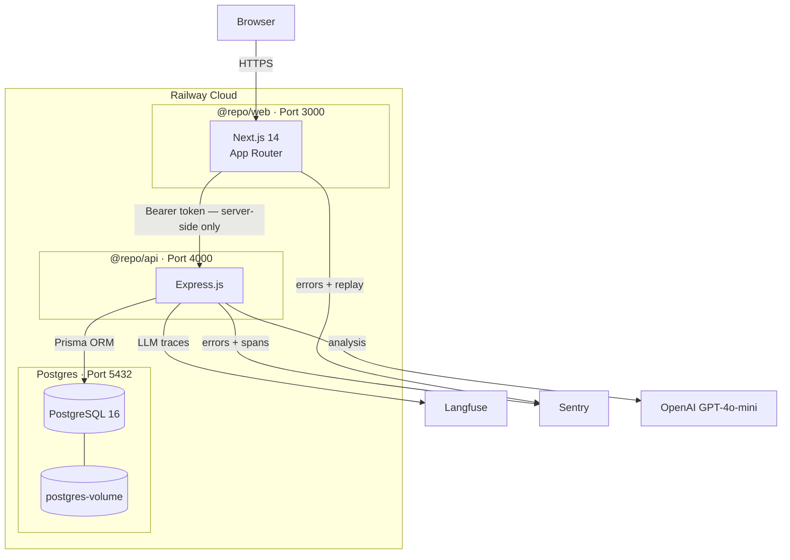

### Backend Request Lifecycle

Every request travels the same path — no shortcuts:

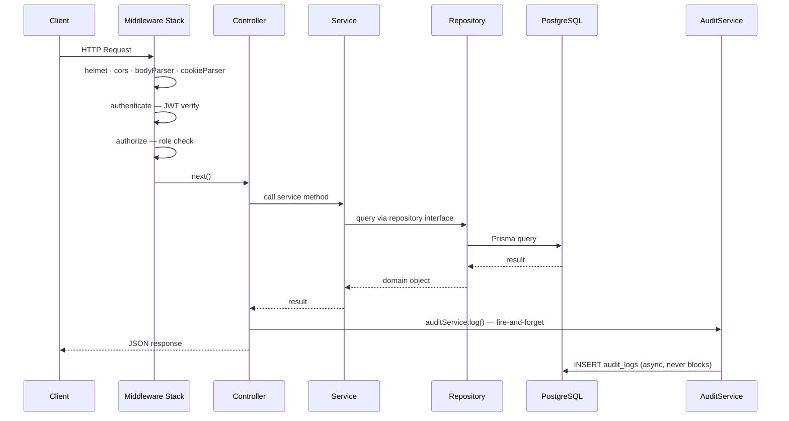

### Authentication Architecture

JWT tokens live exclusively in `httpOnly` cookies — JavaScript cannot read them, eliminating the XSS token-theft surface. Because client components cannot attach the cookie cross-origin, all mutations route through Next.js server-side handlers that read the cookie server-side and forward it as `Bearer`.

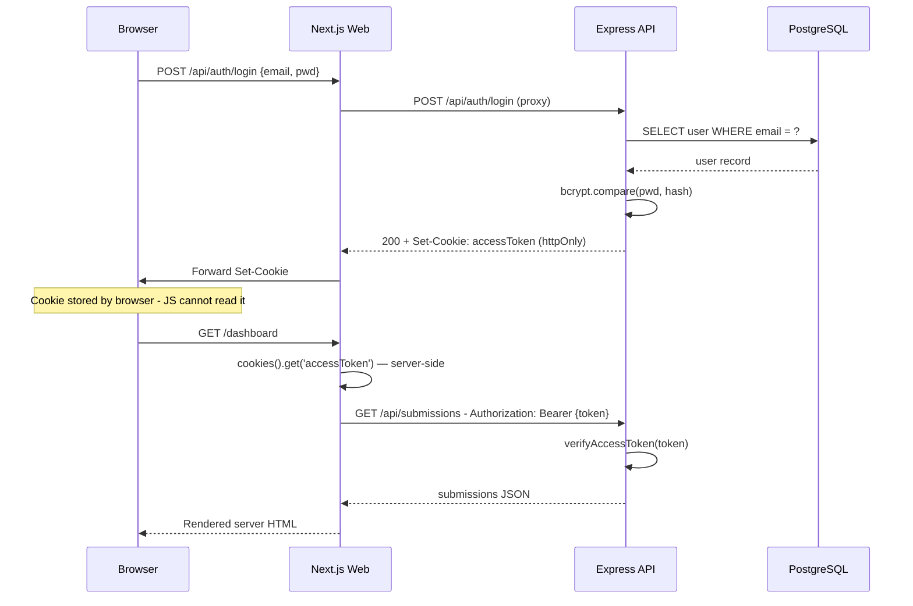

### Authorization Flow

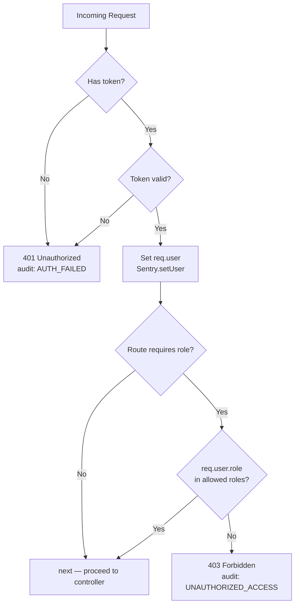

### Frontend Architecture

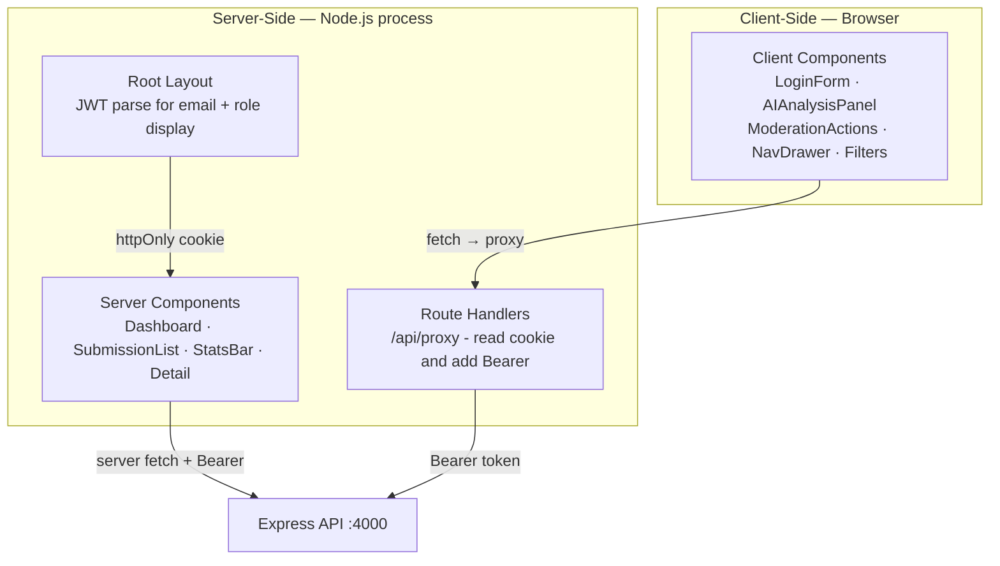

### Observability Stack

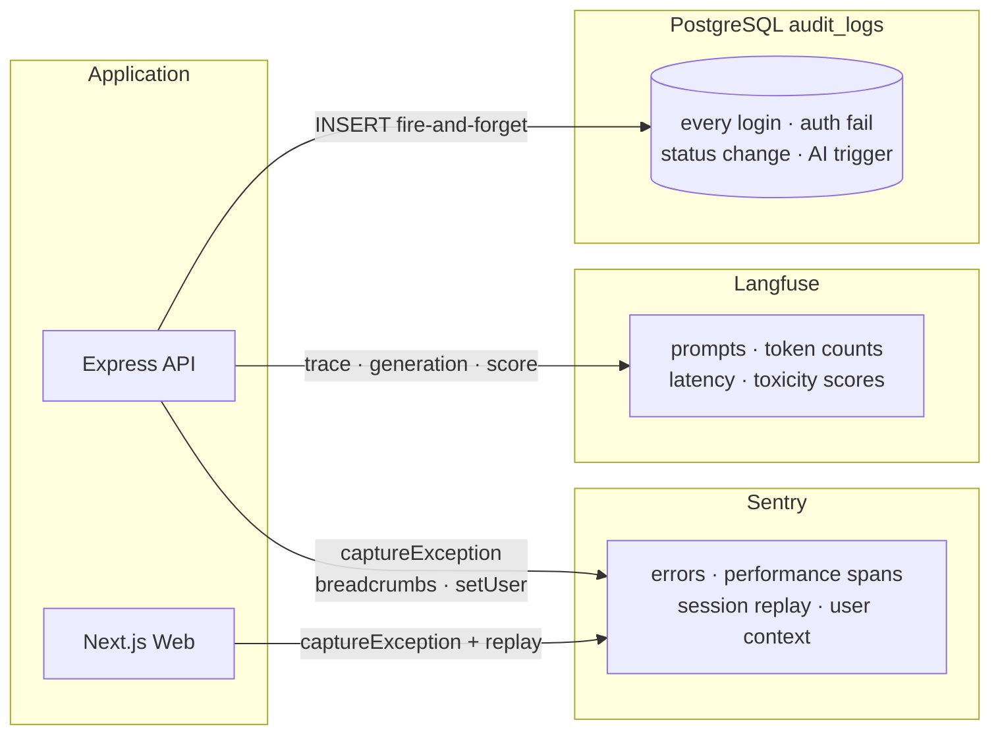

### Deployment Architecture

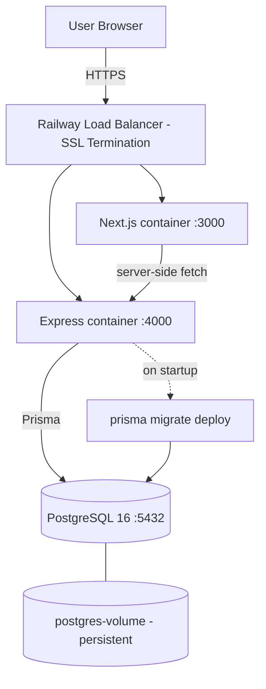

## Database Schema

> All 5 tables, columns, types, and relationships — derived directly from `packages/database/prisma/schema.prisma`.

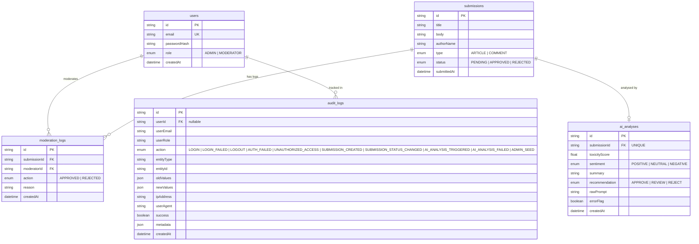

### Relationships & Constraints

| Relationship | Cardinality | On Delete |
|---|---|---|
| `users` → `moderation_logs` | One-to-Many | **RESTRICT** — user cannot be deleted while moderation logs exist |
| `users` → `audit_logs` | One-to-Many | **SET NULL** — audit trail is retained even after user deletion |
| `submissions` → `moderation_logs` | One-to-Many | **CASCADE** — logs are deleted when submission is deleted |
| `submissions` → `ai_analyses` | One-to-One (optional) | **CASCADE** — analysis is deleted when submission is deleted |

---

## Data Flow

How data moves through the system for each core operation.

### 1. Login

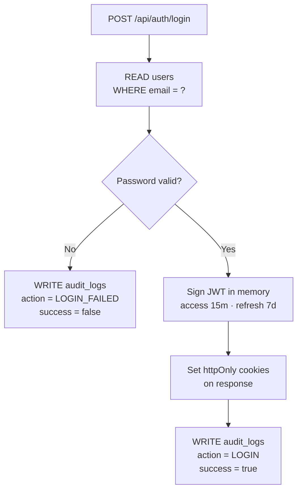

### 2. Create Submission

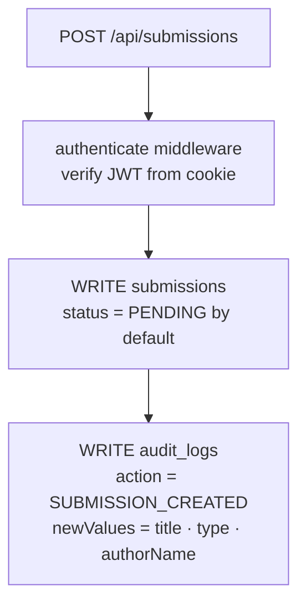

### 3. Trigger AI Analysis

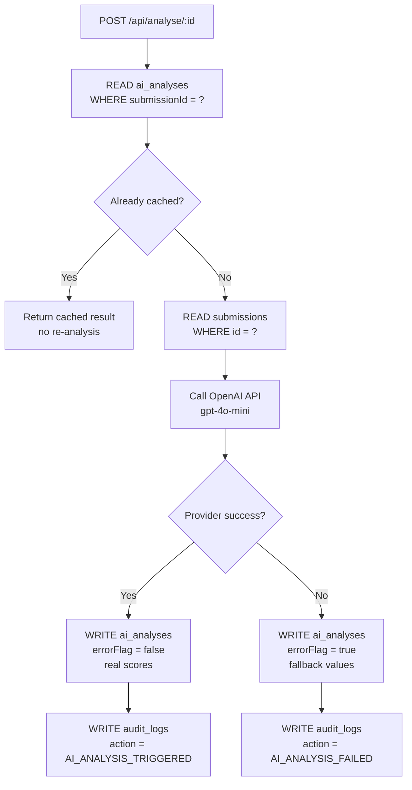

### 4. Update Submission Status

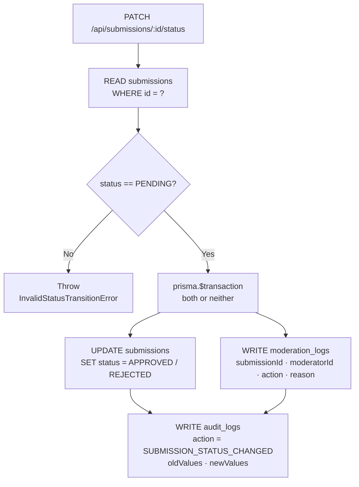

### 5. Admin Seed

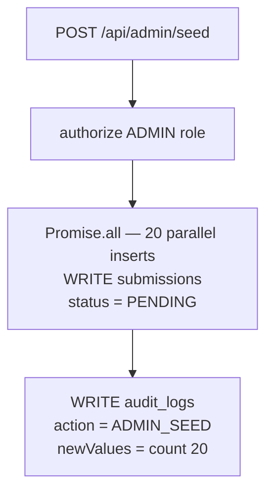

---